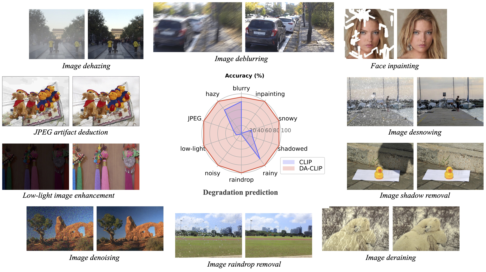
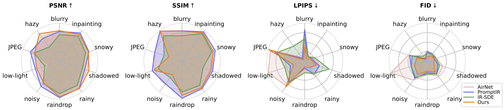
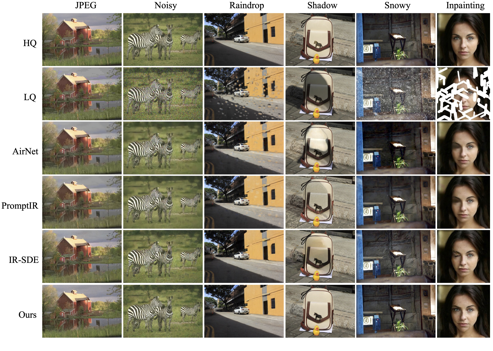
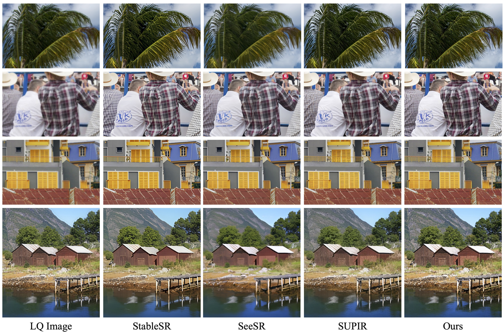

## Controlling Vision-Language Models for Universal Image Restoration <br><sub>Official PyTorch Implementation of DA-CLIP. </sub>

[Project Page](https://algolzw.github.io/daclip-uir) | [Paper](https://arxiv.org/abs/2310.01018) | [Model Card 🤗](https://huggingface.co/weblzw/daclip-uir-ViT-B-32-irsde)

[](https://colab.research.google.com/github/camenduru/daclip-uir-colab/blob/main/daclip_uir_gradio_colab.ipynb) [](https://huggingface.co/spaces/fffiloni/DA-CLIP) [](https://replicate.com/cjwbw/daclip-uir) 



Our follow-up work [Photo-Realistic Image Restoration in the Wild with Controlled Vision-Language Models](https://arxiv.org/abs/2404.09732) (CVPRW 2024) presents a [posterior sampling](https://github.com/Algolzw/daclip-uir/blob/74b7851827b485287971300e4b2a56ea0f8f1d75/universal-image-restoration/utils/sde_utils.py#L297) for better image generation and handles real-world mixed-degradation images similar to [Real-ESRGAN](https://github.com/xinntao/Real-ESRGAN).


### Updates
[**2024.04.16**] Our follow-up paper "[Photo-Realistic Image Restoration in the Wild with Controlled Vision-Language Models](https://arxiv.org/abs/2404.09732)" is on [ArXiv](https://arxiv.org/abs/2404.09732) now! <br>
[**2024.04.15**]  Updated a [wild-IR](https://github.com/Algolzw/daclip-uir/tree/main/universal-image-restoration/config/wild-ir) model for real-world degradations and the [posterior sampling](https://github.com/Algolzw/daclip-uir/blob/74b7851827b485287971300e4b2a56ea0f8f1d75/universal-image-restoration/utils/sde_utils.py#L297) for better image generation. The pretrained weights [wild-ir.pth](https://drive.google.com/file/d/1DqHL61gZJI-3EGsXPJrhERrrst7ZR6gP/view?usp=sharing) and [wild-daclip_ViT-L-14.pt](https://drive.google.com/file/d/1eVxgvwzwLl5oWSVIgnA2gycV6ewLEVJd/view?usp=sharing) are also provided for wild-ir. <br>
[**2024.01.20**]  🎉🎉🎉 Our DA-CLIP paper was accepted by ICLR 2024 🎉🎉🎉 We further provide a more robust model in the [model card](https://huggingface.co/weblzw/daclip-uir-ViT-B-32-irsde/tree/main). <br>
[**2023.10.25**] Added [dataset links](https://github.com/Algolzw/daclip-uir#dataset-links) for training and testing. <br>
[**2023.10.13**] Added the Replicate [demo](https://replicate.com/cjwbw/daclip-uir) and [api](https://replicate.com/cjwbw/daclip-uir/api)🔥. Thanks to [@chenxwh](https://github.com/chenxwh)!!! We updated the Hugging Face [demo](https://huggingface.co/spaces/fffiloni/DA-CLIP)🔥 and online Colab [demo](https://colab.research.google.com/github/camenduru/daclip-uir-colab/blob/main/daclip_uir_gradio_colab.ipynb)🔥. Thanks to [@fffiloni](https://github.com/fffiloni) and [@camenduru](https://github.com/camenduru) !!! We also made a [Model Card](https://huggingface.co/weblzw/daclip-uir-ViT-B-32-irsde) in Hugging Face 🤗 and provided more [examples](https://drive.google.com/file/d/1C1nmP5kJXzxrULxTMVWF5P30qezqP6kn/view?usp=sharing) for testing.<br>
[**2023.10.09**] The **pretrained weights** of DA-CLIP and the Universal IR model are released in [link1](https://drive.google.com/file/d/1A6u4CaVrcpcZckGUNzEXqMF8x_JXsZdX/view?usp=sharing) and [link2](https://drive.google.com/file/d/1eXsyrmAbWOvhIY4Wbt5v4IxaggA5aZMG/view?usp=sharing), respectively. In addition, we also provide a [Gradio](https://gradio.app/) app file for the case that you want to [test your own images](https://github.com/Algolzw/daclip-uir#Gradio).<br>


## How to Run the Code?


### Dependencies

* OS: Ubuntu 20.04
* nvidia:
	- cuda: 11.4
* python 3.8

### Install

We advise you first create a virtual environment with:

```bash
python3 -m venv .env
source .env/bin/activate
pip install -U pip
pip install -r requirements.txt

```

### DA-CLIP Usage

Get into the `universal-image-restoration` directory and run:

```python
import torch
from PIL import Image
import open_clip

checkpoint = 'pretrained/daclip_ViT-B-32.pt'
model, preprocess = open_clip.create_model_from_pretrained('daclip_ViT-B-32', pretrained=checkpoint)
tokenizer = open_clip.get_tokenizer('ViT-B-32')

image = preprocess(Image.open("haze_01.png")).unsqueeze(0)
degradations = ['motion-blurry','hazy','jpeg-compressed','low-light','noisy','raindrop','rainy','shadowed','snowy','uncompleted']
text = tokenizer(degradations)

with torch.no_grad(), torch.cuda.amp.autocast():
    text_features = model.encode_text(text)
    image_features, degra_features = model.encode_image(image, control=True)
    degra_features /= degra_features.norm(dim=-1, keepdim=True)
    text_features /= text_features.norm(dim=-1, keepdim=True)

    text_probs = (100.0 * degra_features @ text_features.T).softmax(dim=-1)
    index = torch.argmax(text_probs[0])

print(f"Task: {task_name}: {degradations[index]} - {text_probs[0][index]}")
```

### Dataset Preparation

Preparing the train and test datasets following our paper Dataset Construction section as:

```bash
#### for training dataset ####
#### (uncompleted means inpainting) ####
datasets/universal/train
|--motion-blurry
|  |--LQ/*.png
|  |--GT/*.png
|--hazy
|--jpeg-compressed
|--low-light
|--noisy
|--raindrop
|--rainy
|--shadowed
|--snowy
|--uncompleted

#### for testing dataset ####
#### (the same structure as train) ####
datasets/universal/val
...

#### for clean captions ####
datasets/universal/daclip_train.csv
datasets/universal/daclip_val.csv
```

Then get into the `universal-image-restoration/config/daclip-sde` directory and modify the dataset paths in option files in `options/train.yml` and `options/test.yml`. 

You can add more tasks or datasets to both `train` and `val` directories and add the degradation word to `distortion`.

#### Dataset Links

| Degradation |                                  motion-blurry                                  |                                                 hazy                                                 |                                                  jpeg-compressed*                                                  |                                   low-light                                   |                                                noisy* (same to jpeg)                                               |
|-------------|:-------------------------------------------------------------------------------:|:----------------------------------------------------------------------------------------------------:|:-----------------------------------------------------------------------------------------------------------------:|:-----------------------------------------------------------------------------:|:-----------------------------------------------------------------------------------------------------------------:|
| Datasets    | [Gopro](https://drive.google.com/file/d/1y4wvPdOG3mojpFCHTqLgriexhbjoWVkK/view) | [RESIDE-6k](https://drive.google.com/drive/folders/1XVD0x74vKQ0-cqazACUZnjUOWURXIeqH?usp=drive_link) | [DIV2K](https://cv.snu.ac.kr/research/EDSR/DIV2K.tar)+[Flickr2K](https://cv.snu.ac.kr/research/EDSR/Flickr2K.tar) | [LOL](https://drive.google.com/file/d/157bjO1_cFuSd0HWDUuAmcHRJDVyWpOxB/view) | [DIV2K](https://cv.snu.ac.kr/research/EDSR/DIV2K.tar)+[Flickr2K](https://cv.snu.ac.kr/research/EDSR/Flickr2K.tar) | 

| Degradation |                                    raindrop                                    |                              rainy                             |                                    shadowed                                   |                                                                                         snowy                                                                                         |                                      uncompleted                                      |
|-------------|:-------------------------------------------------------------------------------:|:----------------------------------------------------------------------------------------------------:|:-----------------------------------------------------------------------------------------------------------------:|:-----------------------------------------------------------------------------:|:-----------------------------------------------------------------------------------------------------------------:|
| Datasets    | [RainDrop](https://drive.google.com/open?id=1e7R76s6vwUJxILOcAsthgDLPSnOrQ49K) | Rain100H: [train](http://www.icst.pku.edu.cn/struct/att/RainTrainH.zip), [test](http://www.icst.pku.edu.cn/struct/att/Rain100H.zip) | [SRD](https://drive.google.com/file/d/1W8vBRJYDG9imMgr9I2XaA13tlFIEHOjS/view) | [Snow100K](https://www.google.com/url?q=https%3A%2F%2Fdesnownet.s3.amazonaws.com%2Fdataset_synthetic%2Ftrain%2FSnow100K-training.tar.gz&sa=D&sntz=1&usg=AOvVaw1Zj_7kQaF0c26DaZcoKEOr) | [CelebaHQ-256](https://drive.google.com/file/d/1oYDBcJLT5RDuC4k5C7xOMRkZ9N3kfexu/view?usp=sharing) |

You should **only extract the train datasets for training**, and all **validation datasets** can be downloaded in the [Google drive](https://drive.google.com/file/d/1JKd1tA7rMoEbI9190daJqL7i6V1L8KUd/view?usp=sharing). For jpeg and noisy datasets, you can generate LQ images using this [script](https://github.com/Algolzw/daclip-uir/blob/main/scripts/generate_LQ.py).

### Training

#### DA-CLIP 
See [DA-CLIP.md](da-clip/README.md) for details.

#### Universal Image Restoration
The main code for training is in `universal-image-restoration/config/daclip-sde` and the core network for DA-CLIP is in `universal-image-restoration/open_clip/daclip_model.py`.

* Put the pretrained [**DA-CLIP weights**](https://drive.google.com/file/d/1A6u4CaVrcpcZckGUNzEXqMF8x_JXsZdX/view?usp=sharing) to `pretrained` directory and check the `daclip` path.

* You can then train the model following below bash scripts:

```bash
cd universal-image-restoration/config/daclip-sde

# For single GPU:
python3 train.py -opt=options/train.yml

# For distributed training, need to change the gpu_ids in option file
python3 -m torch.distributed.launch --nproc_per_node=2 --master_port=4321 train.py -opt=options/train.yml --launcher pytorch
```

The models and training logs will save in `log/universal-ir`. 
You can print your log at time by running `tail -f log/universal-ir/train_universal-ir_***.log -n 100`.

**The same training steps can be used for image restoration in the wild ([wild-ir](https://github.com/Algolzw/daclip-uir/tree/main/universal-image-restoration/config/wild-ir)).**

#### Pretrained Models
| Model Name   | Description                                     | GoogleDrive                                                                                   | HuggingFace                                                                                      |
|--------------|-------------------------------------------------|------------------------------------------------------------------------------------------------|--------------------------------------------------------------------------------------------------|
| DA-CLIP      | Degradation-aware CLIP model                    | [download](https://drive.google.com/file/d/1A6u4CaVrcpcZckGUNzEXqMF8x_JXsZdX/view?usp=sharing) | [download](https://huggingface.co/weblzw/daclip-uir-ViT-B-32-irsde/blob/main/daclip_ViT-B-32.pt) |
| Universal-IR | DA-CLIP based universal image restoration model | [download](https://drive.google.com/file/d/1eXsyrmAbWOvhIY4Wbt5v4IxaggA5aZMG/view?usp=sharing) | [download](https://huggingface.co/weblzw/daclip-uir-ViT-B-32-irsde/blob/main/universal-ir.pth)   |
| DA-CLIP-mix      | Degradation-aware CLIP model (add Gaussian blur + face inpainting and Gaussian blur + Rainy)                   | [download](https://drive.google.com/file/d/12KZK9Apx74pU23OGG9YSybd6gzN_PuGU/view?usp=sharing) | [download](https://huggingface.co/weblzw/daclip-uir-ViT-B-32-irsde/blob/main/daclip_ViT-B-32_mix.pt) |
| Universal-IR-mix | DA-CLIP based universal image restoration model (add robust training and mix-degradations) | [download](https://drive.google.com/file/d/1HRgsEUCw4_m6CC_XYpJGHNjuIMd1jAcm/view?usp=sharing) | [download](https://huggingface.co/weblzw/daclip-uir-ViT-B-32-irsde/blob/main/universal-ir-mix.pth)   |
| Wild-DA-CLIP      | Degradation-aware CLIP model in the wild (ViT-L-14)                | [download](https://drive.google.com/file/d/1eVxgvwzwLl5oWSVIgnA2gycV6ewLEVJd/view?usp=sharing) | [download](https://huggingface.co/weblzw/daclip-uir-ViT-B-32-irsde/blob/main/wild-daclip_ViT-L-14.pt) |
| Wild-IR | DA-CLIP based image restoration model in the wild | [download](https://drive.google.com/file/d/1DqHL61gZJI-3EGsXPJrhERrrst7ZR6gP/view?usp=sharing) | [download](https://huggingface.co/weblzw/daclip-uir-ViT-B-32-irsde/blob/main/wild-ir.pth)   |

### Evaluation
To evalute our method on image restoration, please modify the benchmark path and model path and run

```bash
cd universal-image-restoration/config/universal-ir
python test.py -opt=options/test.yml
```

### Gradio
Here we provide an [app.py](https://github.com/Algolzw/daclip-uir/tree/main/universal-image-restoration/config/daclip-sde/app.py) file for testing your own images. Before that, you need to download the pretrained weights ([DA-CLIP](https://drive.google.com/file/d/1A6u4CaVrcpcZckGUNzEXqMF8x_JXsZdX/view?usp=sharing) and [UIR](https://drive.google.com/file/d/1eXsyrmAbWOvhIY4Wbt5v4IxaggA5aZMG/view?usp=sharing)) and modify the model path in `options/test.yml`. Then by simply running `python app.py`, you can open `http://localhost:7860` to test the model. (We also provide several images with different degradations in the `images` dir). We also provide more examples from our test dataset in the [google drive](https://drive.google.com/file/d/1C1nmP5kJXzxrULxTMVWF5P30qezqP6kn/view?usp=sharing).

**The same steps can be used for image restoration in the wild ([wild-ir](https://github.com/Algolzw/daclip-uir/tree/main/universal-image-restoration/config/wild-ir)).**


### Results



<details>
<summary><strong>Unified Image Restoration</strong> (click to expand) </summary>



</details>

<details>
<summary><strong>Degradation-Specific Restoration</strong> (click to expand) </summary>


</details>

<details>
<summary><strong>Image Restoration in the wild</strong> (click to expand) </summary>



</details>


#### Notice!!
🙁 In testing we found that the current pretrained model is still difficult to process some real-world images  which might have distribution shifts with our training dataset (captured from different devices or with different resolutions or degradations). We regard it as a future work and will try to make our model more practical! We also encourage users who are interested in our work to train their own models with larger dataset and more degradation types.

🙁 BTW, **we also found that directly resizing input images will lead a poor performance for most tasks**. We could try to add the resize step into the training but it always destroys the image quality due to interpolation.

🙁 For the inpainting task our current model only supports face inpainting due to the [dataset limitation](https://github.com/Algolzw/daclip-uir/issues/8#issuecomment-1759528246). We provide our mask [examples](https://github.com/Algolzw/daclip-uir/tree/main/scripts/inpainting_masks) and you can use the [generate\_masked\_face](https://github.com/Algolzw/daclip-uir/blob/main/scripts/generate_masked_face.py) script to generate uncompleted faces.


---

**Acknowledgment:** Our DA-CLIP is based on [IR-SDE](https://github.com/Algolzw/image-restoration-sde) and [open_clip](https://github.com/mlfoundations/open_clip). Thanks for their code!

#### Contact
If you have any question, please contact: ziwei.luo@it.uu.se


### Citations
If our code helps your research or work, please consider citing our paper.
The following are BibTeX references:

```
@article{luo2023controlling,
  title={Controlling Vision-Language Models for Universal Image Restoration},
  author={Luo, Ziwei and Gustafsson, Fredrik K and Zhao, Zheng and Sj{\"o}lund, Jens and Sch{\"o}n, Thomas B},
  journal={arXiv preprint arXiv:2310.01018},
  year={2023}
}

@article{luo2024photo,
  title={Photo-Realistic Image Restoration in the Wild with Controlled Vision-Language Models},
  author={Luo, Ziwei and Gustafsson, Fredrik K and Zhao, Zheng and Sj{\"o}lund, Jens and Sch{\"o}n, Thomas B},
  journal={arXiv preprint arXiv:2404.09732},
  year={2024}
}
```

---


#### --- Thanks for your interest! --- ####

<details>
<summary>statistics</summary>


</details>

