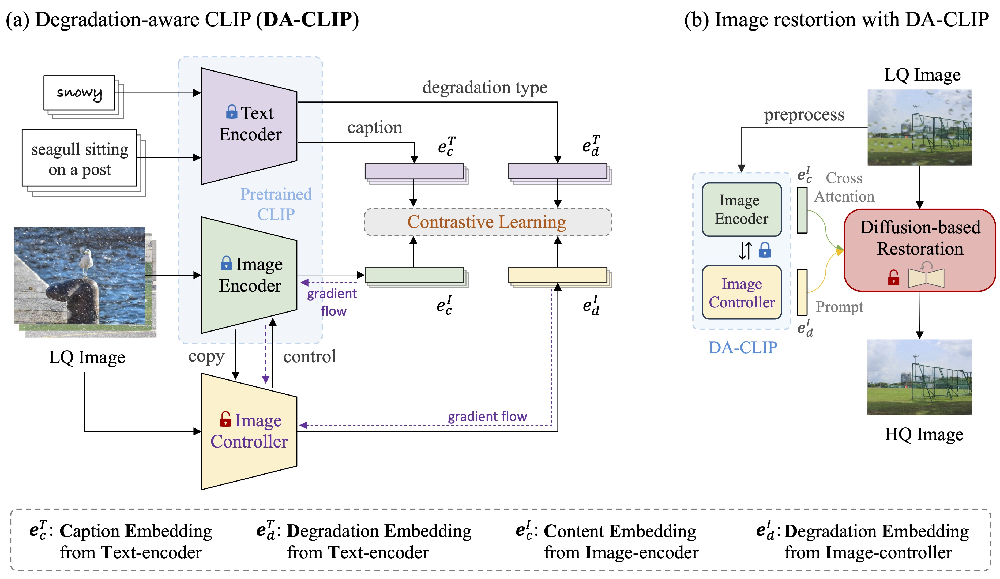

# DA-CLIP

This repository is based on the OpenAI's [CLIP](https://arxiv.org/abs/2212.07143) (Contrastive Language-Image Pre-training) and [open_clip](https://github.com/mlfoundations/open_clip). 

We extend the CLIP to a degradation-aware version ([DA-CLIP](https://arxiv.org/abs/2310.01018)) which predicts both degradation embedding and clean content embedding from corrupted images. Then we can use these embeddings to improve image restoration performance and assist unified image restoration. Moreover, we use the pretrained ViT CLIP model (**ViT-B/32 on [LAION-2B](https://laion.ai/blog/laion-5b/)**) and add an additional controller to control the image encoder.
  

## Approach




## Training DA-CLIP

### Install

We advise you first create a virtual environment with:

```
python3 -m venv .env
source .env/bin/activate
pip install -U pip
```

You can then install openclip for training with `pip install 'open_clip_torch[training]'`.


### Create dataset:
To generate clean captions with BLIP, we use the [clip-interrogator](https://github.com/pharmapsychotic/clip-interrogator) tool. Install it with `pip install clip-interrogator==0.6.0` and run:

```bash
python ../scripts/generate_captions.py
```
Then you will get `daclip_train.csv` and `daclip_val.csv` under the `datasets/universal` directory.

### Single-process running code:


```bash
cd ./src

python -m training.main \
    --save-frequency 1 \
    --zeroshot-frequency 1 \
    --report-to tensorboard \
    --train-data="datasets/universal/daclip_train.csv"  \
    --val-data="datasets/universal/daclip_val.csv"  \
    --csv-img-key filepath \
    --csv-caption-key title \
    --warmup 100 \
    --batch-size=784 \
    --lr=2e-5 \
    --wd=0.05 \
    --epochs=30 \
    --workers=8 \
    --model daclip_ViT-B-32 \
    --name "daclip_ViT-B-32_b784x1_lr2e-5_e50" \
    --pretrained "laion2b_s34b_b79k" \
    --da
```

### Multi-GPU running code:

We make use of `torchrun` to launch distributed jobs. The following launches a
a job on a node of 4 GPUs:

```bash
cd ./src

torchrun --nproc_per_node 4 -m training.main \
    --save-frequency 1 \
    --zeroshot-frequency 1 \
    --report-to tensorboard \
    --train-data="datasets/universal/daclip_train.csv"  \
    --val-data="datasets/universal/daclip_val.csv"  \
    --csv-img-key filepath \
    --csv-caption-key title \
    --warmup 100 \
    --batch-size=784 \
    --lr=3e-5 \
    --wd=0.05 \
    --epochs=50 \
    --workers=8 \
    --model daclip_ViT-B-32 \
    --name "daclip_ViT-B-32_b768x4_lr3e-5_e50" \
    --pretrained "laion2b_s34b_b79k" \
    --da
```
You can also change the model and remove the `--da` option to enable normal CLIP training/finetuning.

### Evaluation

To evaluation the performance on image degradation classification, run:

```bash
cd ./src
python evaluate.py
```

## Citing

If you found this repository useful, please consider citing:

```bibtex
@article{luo2023controlling,
  title={Controlling Vision-Language Models for Universal Image Restoration},
  author={Luo, Ziwei and Gustafsson, Fredrik K and Zhao, Zheng and Sj{\"o}lund, Jens and Sch{\"o}n, Thomas B},
  journal={arXiv preprint arXiv:2310.01018},
  year={2023}
}
```

```bibtex
@inproceedings{Radford2021LearningTV,
  title={Learning Transferable Visual Models From Natural Language Supervision},
  author={Alec Radford and Jong Wook Kim and Chris Hallacy and A. Ramesh and Gabriel Goh and Sandhini Agarwal and Girish Sastry and Amanda Askell and Pamela Mishkin and Jack Clark and Gretchen Krueger and Ilya Sutskever},
  booktitle={ICML},
  year={2021}
}
```